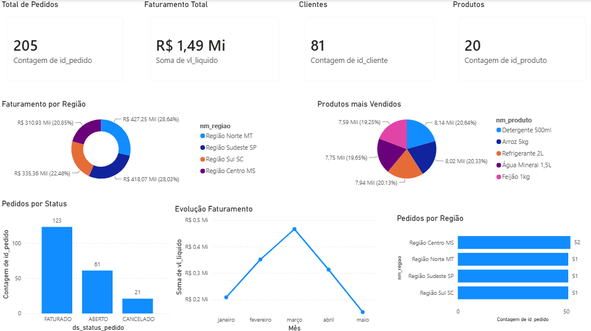

# Projeto VendasMais

## Objetivo

Este projeto tem como objetivo desenvolver uma solução de Business Intelligence utilizando Azure Functions, Azure SQL Database e Power BI, permitindo a sincronização de dados de um banco SQL Server e a visualização de indicadores de vendas em um dashboard interativo.

---

## Tecnologias Utilizadas

- Python
- Azure Functions
- Azure SQL Database
- SQL Server
- Power BI
- Git
- GitHub

---

## Arquitetura da Solução

```
SQL Server (Origem)
        │
        ▼
Azure Functions (ETL)
        │
        ▼
Azure SQL Database
        │
        ▼
Power BI Dashboard
```

---

## Indicadores Desenvolvidos

- Total de Pedidos
- Faturamento Total
- Clientes Cadastrados
- Produtos Cadastrados
- Faturamento por Região
- Pedidos por Região
- Produtos Mais Vendidos
- Pedidos por Status
- Evolução do Faturamento

---

## Dashboard

### Visão Geral



---

## Estrutura do Projeto

```
Projeto-VendasMais/
│
├── Dashboard/
│   └── Dashboard_VendasMais.pbix
│
├── Imagens/
│   └── dashboard.png
│
├── Azure Functions
├── requirements.txt
├── host.json
└── README.md
```

---

## Integrantes

- Cauã Richlin
- Leandro Bittencourt
- Arthur Zimmermann